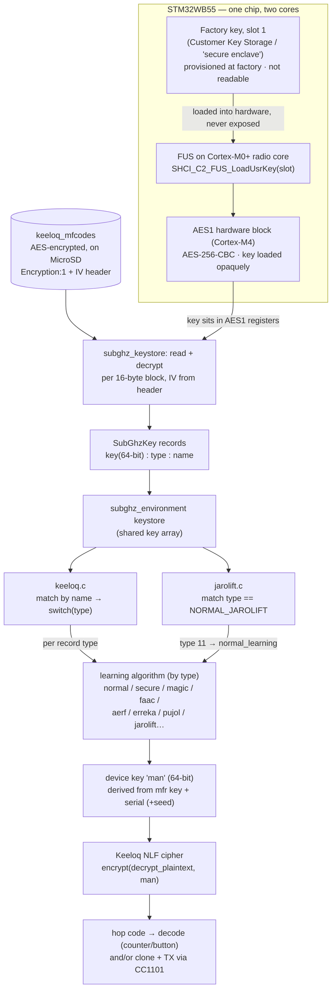
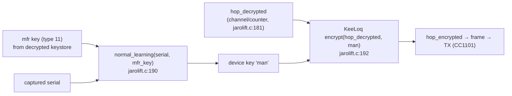

# Keeloq crypto chain — from the hardware-bound key to the algorithm input

This traces the **complete cryptographic path** on a Flipper Zero: from the
factory key burned into the STM32WB55's secure key storage, through the AES
decryption of the manufacturer keystore, down to the **per-algorithm derivation**
(e.g. Jarolift) that produces a device key and the final Keeloq rolling code.

> **Code links** point to **Unleashed** at the exact commit this analysis pins
> (`318bfc3b000173029eb391758eea7dfa03006acb`), because it contains the full set
> of learning algorithms and the Jarolift protocol. The enclave/keystore code is
> byte-identical in Official/Momentum; RogueMaster differs only in `furi_hal_crypto.c`
> (adds AES-ECB, refactors `load_key`) — same slot-1/FUS mechanism. Base:
> `https://github.com/DarkFlippers/unleashed-firmware/blob/318bfc3b000173029eb391758eea7dfa03006acb/`

## The chain at a glance

## Stage-by-stage (with code permalinks)

**1 — Factory key in the secure enclave (CKS).** Slot 1 of 10 factory slots; written
at manufacturing, never in the repo, no software read-back.
- [`furi_hal_crypto.c:13`](https://github.com/DarkFlippers/unleashed-firmware/blob/318bfc3b000173029eb391758eea7dfa03006acb/targets/f7/furi_hal/furi_hal_crypto.c#L13) — `ENCLAVE_FACTORY_KEY_SLOTS 10`
- [`furi_hal_crypto.c:193`](https://github.com/DarkFlippers/unleashed-firmware/blob/318bfc3b000173029eb391758eea7dfa03006acb/targets/f7/furi_hal/furi_hal_crypto.c#L193) — `SHCI_C2_FUS_StoreUsrKey` (how a key is *written* into CKS)

**2 — Load the key into AES hardware (opaque).** FUS loads slot 1 straight into the
`AES1` key registers; the M4 sets only the IV.
- [`furi_hal_crypto.c:258`](https://github.com/DarkFlippers/unleashed-firmware/blob/318bfc3b000173029eb391758eea7dfa03006acb/targets/f7/furi_hal/furi_hal_crypto.c#L258) — `furi_hal_crypto_enclave_load_key(slot, iv)`
- [`furi_hal_crypto.c:277`](https://github.com/DarkFlippers/unleashed-firmware/blob/318bfc3b000173029eb391758eea7dfa03006acb/targets/f7/furi_hal/furi_hal_crypto.c#L277) — `SHCI_C2_FUS_LoadUsrKey(slot)`
- [`furi_hal_crypto.c:198`](https://github.com/DarkFlippers/unleashed-firmware/blob/318bfc3b000173029eb391758eea7dfa03006acb/targets/f7/furi_hal/furi_hal_crypto.c#L198) — `crypto_key_init` (sets IV; [`:206`](https://github.com/DarkFlippers/unleashed-firmware/blob/318bfc3b000173029eb391758eea7dfa03006acb/targets/f7/furi_hal/furi_hal_crypto.c#L206) writes `AES1->KEYR*`)

**3 — Decrypt the manufacturer keystore.** Slot 1 is loaded, the encrypted
`keeloq_mfcodes` (on SD) is decrypted block-by-block (AES-256-CBC, IV from the file
header) into plaintext lines.
- [`subghz_keystore.c:21`](https://github.com/DarkFlippers/unleashed-firmware/blob/318bfc3b000173029eb391758eea7dfa03006acb/lib/subghz/subghz_keystore.c#L21) — `SUBGHZ_KEYSTORE_FILE_ENCRYPTION_KEY_SLOT 1`
- [`subghz_keystore.c:125`](https://github.com/DarkFlippers/unleashed-firmware/blob/318bfc3b000173029eb391758eea7dfa03006acb/lib/subghz/subghz_keystore.c#L125) — load slot 1 → [`:151`](https://github.com/DarkFlippers/unleashed-firmware/blob/318bfc3b000173029eb391758eea7dfa03006acb/lib/subghz/subghz_keystore.c#L151) `furi_hal_crypto_decrypt(...)`
- [`subghz_keystore.c:90`](https://github.com/DarkFlippers/unleashed-firmware/blob/318bfc3b000173029eb391758eea7dfa03006acb/lib/subghz/subghz_keystore.c#L90) — *"Please do not share decrypted manufacture keys"*

**4 — Parse records into the key array.** Each decrypted line is `key : type : name`.
- [`subghz_keystore.c:76`](https://github.com/DarkFlippers/unleashed-firmware/blob/318bfc3b000173029eb391758eea7dfa03006acb/lib/subghz/subghz_keystore.c#L76) — `sscanf(line, "%16s:%hu:%64s", skey, &type, name)`
- [`subghz_keystore.c:71`](https://github.com/DarkFlippers/unleashed-firmware/blob/318bfc3b000173029eb391758eea7dfa03006acb/lib/subghz/subghz_keystore.c#L71) — `subghz_keystore_process_line`

**5 — A protocol derives the device key, then runs the cipher.** It walks the key
array, picks a record, derives the per-remote key `man` via the **learning algorithm
chosen by `type`**, and computes the hop code with the Keeloq NLF cipher.
- [`keeloq.c:433`](https://github.com/DarkFlippers/unleashed-firmware/blob/318bfc3b000173029eb391758eea7dfa03006acb/lib/subghz/protocols/keeloq.c#L433) — iterate keystore (`M_EACH`) → [`:439`](https://github.com/DarkFlippers/unleashed-firmware/blob/318bfc3b000173029eb391758eea7dfa03006acb/lib/subghz/protocols/keeloq.c#L439) `switch(manufacture_code->type)`
- [`keeloq_common.c:16`](https://github.com/DarkFlippers/unleashed-firmware/blob/318bfc3b000173029eb391758eea7dfa03006acb/lib/subghz/protocols/keeloq_common.c#L16) — `..._encrypt` (the NLF cipher; uses [`keeloq_common.h:13`](https://github.com/DarkFlippers/unleashed-firmware/blob/318bfc3b000173029eb391758eea7dfa03006acb/lib/subghz/protocols/keeloq_common.h#L13) `KEELOQ_NLF`) · [`:30`](https://github.com/DarkFlippers/unleashed-firmware/blob/318bfc3b000173029eb391758eea7dfa03006acb/lib/subghz/protocols/keeloq_common.c#L30) `..._decrypt`

## The learning algorithms (the "individual algorithms" inputs)

`type` (a single `uint16` per record) selects how the **64-bit manufacturer key** +
the captured **serial** (and, for secure types, the **seed**) become the 64-bit device
key `man`. Enum: [`keeloq_common.h:19-34`](https://github.com/DarkFlippers/unleashed-firmware/blob/318bfc3b000173029eb391758eea7dfa03006acb/lib/subghz/protocols/keeloq_common.h#L19-L34).

| `type` | Name | Inputs → device key `man` | Definition |
|---|---|---|---|
| 1 | SIMPLE | `man = mfr_key` (used directly) | dispatch [`keeloq.c:442`](https://github.com/DarkFlippers/unleashed-firmware/blob/318bfc3b000173029eb391758eea7dfa03006acb/lib/subghz/protocols/keeloq.c#L442) |
| 2 | NORMAL | `normal_learning(serial, mfr_key)` | [`keeloq_common.c:43`](https://github.com/DarkFlippers/unleashed-firmware/blob/318bfc3b000173029eb391758eea7dfa03006acb/lib/subghz/protocols/keeloq_common.c#L43) |
| 3 | SECURE | `secure_learning(serial, seed, mfr_key)` | [`keeloq_common.c:64`](https://github.com/DarkFlippers/unleashed-firmware/blob/318bfc3b000173029eb391758eea7dfa03006acb/lib/subghz/protocols/keeloq_common.c#L64) |
| 4 | MAGIC_XOR_TYPE_1 | `magic_xor_type1_learning(serial, mfr_key)` | [`keeloq_common.c:84`](https://github.com/DarkFlippers/unleashed-firmware/blob/318bfc3b000173029eb391758eea7dfa03006acb/lib/subghz/protocols/keeloq_common.c#L84) |
| 5 | FAAC | `faac_learning(seed, mfr_key)` | [`keeloq_common.c:96`](https://github.com/DarkFlippers/unleashed-firmware/blob/318bfc3b000173029eb391758eea7dfa03006acb/lib/subghz/protocols/keeloq_common.c#L96) |
| 6 | MAGIC_SERIAL_TYPE_1 | `magic_serial_type1_learning(serial, mfr_key)` | [`keeloq_common.c:111`](https://github.com/DarkFlippers/unleashed-firmware/blob/318bfc3b000173029eb391758eea7dfa03006acb/lib/subghz/protocols/keeloq_common.c#L111) |
| 11 | NORMAL_JAROLIFT | `normal_learning(serial, mfr_key)` (see Jarolift below) | [`jarolift.c:190`](https://github.com/DarkFlippers/unleashed-firmware/blob/318bfc3b000173029eb391758eea7dfa03006acb/lib/subghz/protocols/jarolift.c#L190) |
| 12 | ERREKA | `learning_erreka(data, mix, mfr_key)` | [`keeloq_common.c:216`](https://github.com/DarkFlippers/unleashed-firmware/blob/318bfc3b000173029eb391758eea7dfa03006acb/lib/subghz/protocols/keeloq_common.c#L216) |
| 13 | PUJOL | `learning_pujol(data, mfr_key)` | [`keeloq_common.c:229`](https://github.com/DarkFlippers/unleashed-firmware/blob/318bfc3b000173029eb391758eea7dfa03006acb/lib/subghz/protocols/keeloq_common.c#L229) |
| 14 | AERF | `learning_aerf(data, mfr_key)` | [`keeloq_common.c:203`](https://github.com/DarkFlippers/unleashed-firmware/blob/318bfc3b000173029eb391758eea7dfa03006acb/lib/subghz/protocols/keeloq_common.c#L203) |

The non-linear extender shared by several brand schemes: [`manufacturer_nl_extend` `keeloq_common.c:146`](https://github.com/DarkFlippers/unleashed-firmware/blob/318bfc3b000173029eb391758eea7dfa03006acb/lib/subghz/protocols/keeloq_common.c#L146), [`decrypt_derived` `:189`](https://github.com/DarkFlippers/unleashed-firmware/blob/318bfc3b000173029eb391758eea7dfa03006acb/lib/subghz/protocols/keeloq_common.c#L189).
**FAAC, ERREKA, PUJOL, AERF are fork-added** (not in Official) — see PROVENANCE.

## Worked example: Jarolift

Jarolift is its own protocol file but reuses the *same* keystore + NORMAL learning.

- [`jarolift.c:101`](https://github.com/DarkFlippers/unleashed-firmware/blob/318bfc3b000173029eb391758eea7dfa03006acb/lib/subghz/protocols/jarolift.c#L101) — gets the shared keystore (`subghz_environment_get_keystore`)
- [`jarolift.c:187`](https://github.com/DarkFlippers/unleashed-firmware/blob/318bfc3b000173029eb391758eea7dfa03006acb/lib/subghz/protocols/jarolift.c#L187) — iterate records (`M_EACH`) → [`:188`](https://github.com/DarkFlippers/unleashed-firmware/blob/318bfc3b000173029eb391758eea7dfa03006acb/lib/subghz/protocols/jarolift.c#L188) keep `type == KEELOQ_LEARNING_NORMAL_JAROLIFT`
- [`jarolift.c:190`](https://github.com/DarkFlippers/unleashed-firmware/blob/318bfc3b000173029eb391758eea7dfa03006acb/lib/subghz/protocols/jarolift.c#L190) — `man = normal_learning(serial, mfr_key)` (device key) → [`:192`](https://github.com/DarkFlippers/unleashed-firmware/blob/318bfc3b000173029eb391758eea7dfa03006acb/lib/subghz/protocols/jarolift.c#L192) `hop_encrypted = encrypt(hop_decrypted, man)`

So the **input to the Jarolift algorithm** is exactly: the *decrypted manufacturer key*
(of type 11) **+** the captured *serial*. The manufacturer key only exists in cleartext
*after* stages 1–3 above — i.e. the hardware-bound slot-1 key is the root of the whole
chain.

## Why "extending the keystore" did **not** require knowing the AES key
Adding records means *encrypting* new `key:type:name` lines under slot 1 — which any
Flipper can do **without** knowing the key bytes, because the enclave is a two-way
oracle:
- keystore **encrypt+save** path: [`subghz_keystore.c:283`](https://github.com/DarkFlippers/unleashed-firmware/blob/318bfc3b000173029eb391758eea7dfa03006acb/lib/subghz/subghz_keystore.c#L283) (load slot 1) + [`furi_hal_crypto.c:336`](https://github.com/DarkFlippers/unleashed-firmware/blob/318bfc3b000173029eb391758eea7dfa03006acb/targets/f7/furi_hal/furi_hal_crypto.c#L336) `furi_hal_crypto_encrypt`
- user-facing oracle: the `crypto` CLI `encrypt <slot> <iv>` ([`applications/services/crypto/crypto_cli.c`](https://github.com/DarkFlippers/unleashed-firmware/blob/318bfc3b000173029eb391758eea7dfa03006acb/applications/services/crypto/crypto_cli.c))

What the forks needed was the **plaintext manufacturer keys** (public Keeloq community
knowledge), not extraction of the device-bound AES key. The slot-1 key is the *same on
every Flipper*, so the keystore encryption is a uniform obfuscation/licensing barrier —
see `SECURITY.md → Secure enclave (CKS)`.

---
*Links pinned to Unleashed `318bfc3b`. See `HARDWARE.md` for the hardware map and
`SECURITY.md` for the enclave threat model.*
